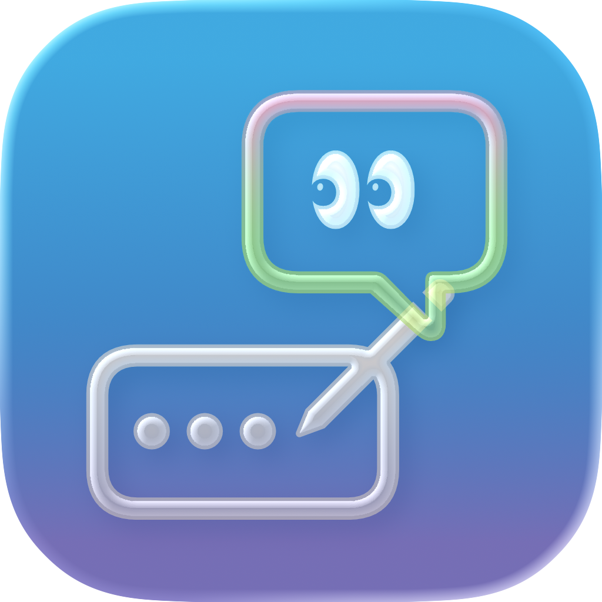

<p align="center">
  
</p>

<h1 align="center">Sayless</h1>

<p align="center">
  A macOS menu bar app that reads your focused KakaoTalk conversation and suggests three replies you can send without breaking flow.
</p>

<p align="center">
  
  
  
  
</p>

## Overview

Sayless is a lightweight reply assistant for macOS. Press a global shortcut while your KakaoTalk input is focused, and Sayless opens a glassy overlay with three context-aware replies. Pick one, refresh the set, or ask for a different tone.

The app is built as a native Swift menu bar utility with a Fastify backend for AI generation, authentication, database-backed usage, and future billing.

## Features

- Global shortcut overlay for focused KakaoTalk chats
- Three AI-generated reply options per request
- Refresh and tone adjustment controls
- Custom instruction input for reply style
- Native macOS glass UI
- Preferences window with General and Account tabs
- Clerk authentication in the macOS app
- Fastify backend with Clerk token verification
- Turso + Drizzle schema for users, subscriptions, and usage events
- Sparkle-ready update packaging scripts

## Stack

- App: Swift, SwiftUI, AppKit, Accessibility APIs
- Auth: Clerk
- Backend: Node.js, Fastify, TypeScript
- Database: Turso, Drizzle ORM
- AI providers: Gemini, OpenAI-compatible providers, Groq
- Updates: Sparkle

## Repository

```text
Sayless/
  Sayless/             macOS app source
  Config/              app Info.plist and build config inputs
  backend/             Fastify API server
  scripts/             release, DMG, and appcast helpers
  assets/              README and project assets
```

## Requirements

- macOS
- Xcode
- Node.js 20.11+
- A Clerk application
- A Turso database
- An AI provider key

## Build The macOS App

```bash
xcodebuild \
  -project Sayless.xcodeproj \
  -scheme Sayless \
  -configuration Debug \
  build
```

For a release build:

```bash
scripts/build-release.sh
```

## Run The Backend

```bash
cd backend
npm install
npm run dev
```

Required backend environment variables:

```env
CLERK_SECRET_KEY=
CLERK_PUBLISHABLE_KEY=
TURSO_DATABASE_URL=
TURSO_AUTH_TOKEN=
AI_PROVIDER=gemini
GEMINI_API_KEY=
```

See [backend/.env.example](backend/.env.example) for the current template.

## Database

Generate and apply Drizzle migrations:

```bash
cd backend
npm run db:generate
npm run db:migrate
```

The current schema includes:

- `users`
- `subscriptions`
- `usage_events`

## Authentication

Sayless uses Clerk in two places:

- The macOS app uses ClerkKit and ClerkKitUI for sign-in, sign-up, and profile management.
- The backend verifies Clerk session tokens on protected API routes.

When signed in, the app attaches a Clerk session token to `/suggestions` requests:

```http
Authorization: Bearer <clerk-session-token>
```

## Distribution

Create a first-install DMG:

```bash
APP_PATH=/path/to/Sayless.app scripts/create-dmg.sh
```

Create a Sparkle update ZIP:

```bash
APP_PATH=/path/to/Sayless.app scripts/release-local.sh
```

Do not commit generated files from `dist/`.

## Status

Sayless is early-stage software. Core overlay generation and authentication are implemented. Billing, usage limits, and polish around account state are still in progress.

## License

Sayless is licensed under the [GNU Affero General Public License v3.0](LICENSE).
