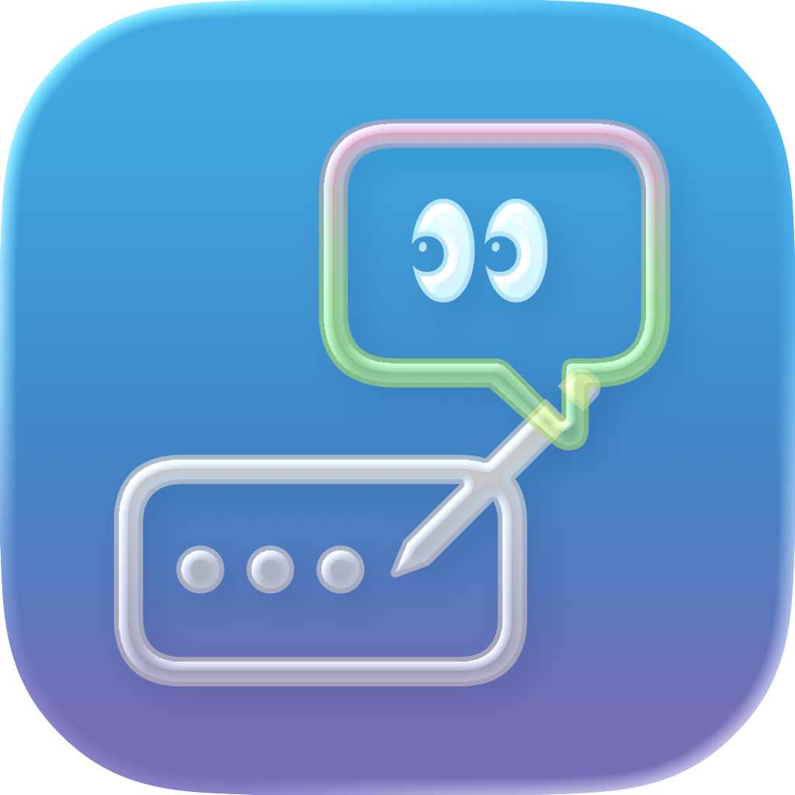

<p align="center">
  
</p>

<h1 align="center">Sayless</h1>

<p align="center">
  <strong><a href="https://ispaik06.github.io/Sayless/">Visit the Sayless Website</a></strong>
</p>

<p align="center">
  Deprecated macOS menu bar app experiment for AI-assisted chat replies.
</p>

<p align="center">
  
  
  
  
  
</p>

## Deprecation Notice

Sayless development has ended. The hosted backend, AI suggestions, authentication-backed account features, usage tracking, and release-download redirect are no longer supported.

This repository remains available as an archived source reference. You can still inspect, build, or fork the code, but there is no maintained production service behind the app.

## Overview

Sayless was a lightweight reply assistant for macOS. Pressing a global shortcut while a supported chat input was focused opened a glassy overlay with three context-aware replies.

The app was built as a native Swift menu bar utility with a TypeScript backend for AI generation, authentication, database-backed usage, and planned billing. The backend code is no longer operated as a supported service.

## Features

- Global shortcut overlay for focused KakaoTalk chats
- Three AI-generated reply options per request
- Refresh and tone adjustment controls
- Custom instruction input for reply style
- Native macOS glass UI
- Preferences window with General and Account tabs
- Clerk authentication in the macOS app
- Backend source with Clerk token verification
- Turso + Drizzle schema for users, subscriptions, and usage events
- Sparkle-ready update packaging scripts

## Stack

- App: Swift, SwiftUI, AppKit, Accessibility APIs
- Auth: Clerk
- Backend: TypeScript source retained for reference, not hosted or supported
- Database: Turso, Drizzle ORM
- AI providers: Gemini, OpenAI-compatible providers, Groq
- Updates: Sparkle

## Repository

```text
Sayless/
  Sayless/             macOS app source
  Config/              app Info.plist and build config inputs
  backend/             Unsupported backend source archive
  scripts/             release, DMG, and appcast helpers
  assets/              README and project assets
```

## Requirements

- macOS
- Xcode
- Node.js 20.11+ for local tooling
- A Clerk application
- A Turso database
- An AI provider key

## Build The macOS App

```bash
xcodebuild \
  -project Sayless.xcodeproj \
  -scheme Sayless \
  -configuration Debug \
  build
```

For a release build:

```bash
scripts/build-release.sh
```

## Backend Status

The backend is deprecated and should be treated as reference code only. Do not expect hosted endpoints, account status, AI suggestions, or `/download` redirects to remain available.

If you fork Sayless and want to run your own service, you will need to provide your own Clerk, Turso, AI provider, and deployment configuration.

## Run The Backend Locally

```bash
cd backend
npm install
npm run dev
```

Local development requires your own secrets. The previous production service is not available:

```bash
cd backend
npx wrangler secret put CLERK_SECRET_KEY
npx wrangler secret put CLERK_PUBLISHABLE_KEY
npx wrangler secret put TURSO_DATABASE_URL
npx wrangler secret put TURSO_AUTH_TOKEN
npx wrangler secret put GEMINI_API_KEY
```

Required backend variables/secrets:

```env
CLERK_SECRET_KEY=
CLERK_PUBLISHABLE_KEY=
TURSO_DATABASE_URL=
TURSO_AUTH_TOKEN=
AI_PROVIDER=gemini
GEMINI_API_KEY=
```

See [backend/.env.example](backend/.env.example) for the current template.

## Database

Generate and apply Drizzle migrations:

```bash
cd backend
npm run db:generate
npm run db:migrate
```

The current schema includes:

- `users`
- `subscriptions`
- `usage_events`

## Authentication

Sayless uses Clerk in two places:

- The macOS app uses ClerkKit and ClerkKitUI for sign-in, sign-up, and profile management.
- The backend verifies Clerk session tokens on protected API routes.

When signed in, the app attaches a Clerk session token to `/suggestions` requests:

```http
Authorization: Bearer <clerk-session-token>
```

## Distribution

Create a first-install DMG:

```bash
APP_PATH=/path/to/Sayless.app scripts/create-dmg.sh
```

Create a Sparkle update ZIP:

```bash
APP_PATH=/path/to/Sayless.app scripts/release-local.sh
```

Do not commit generated files from `dist/`.

## Status

Sayless is deprecated. No new features, hosted backend support, billing work, or production release maintenance is planned.

## License

Sayless is licensed under the [GNU Affero General Public License v3.0](LICENSE).
